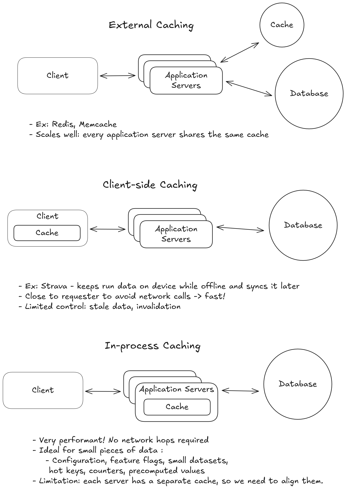
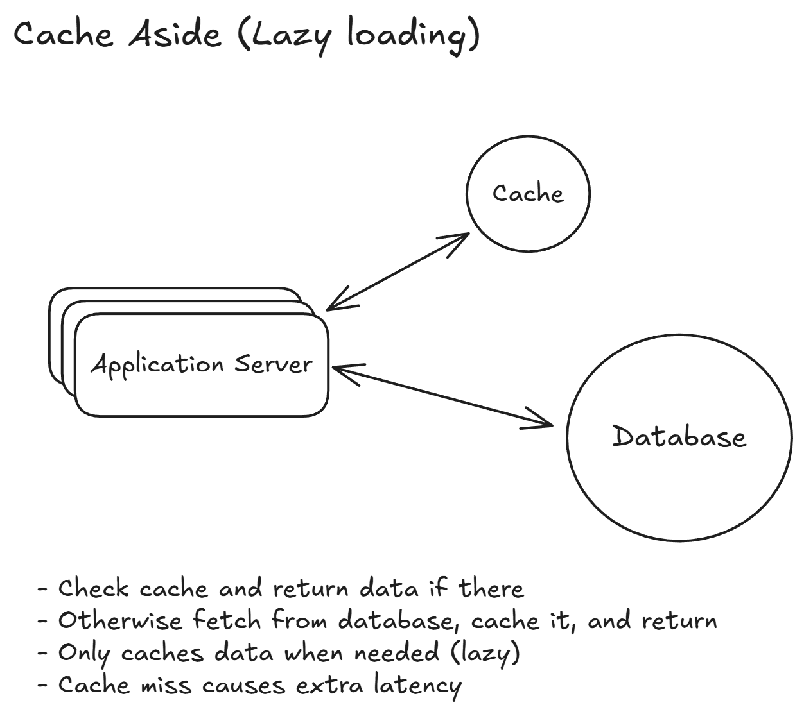
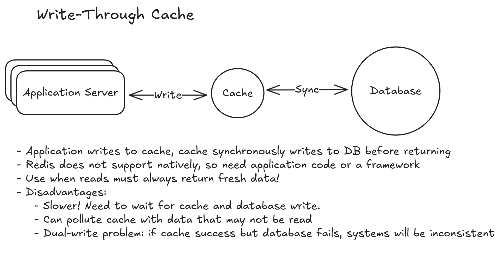
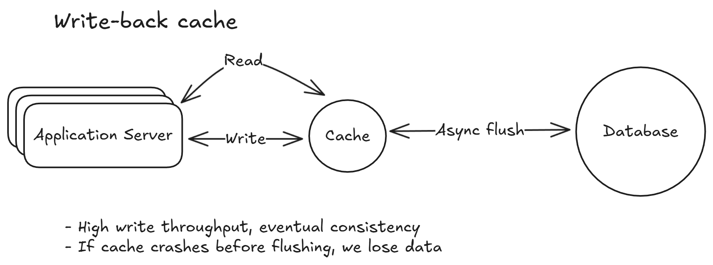
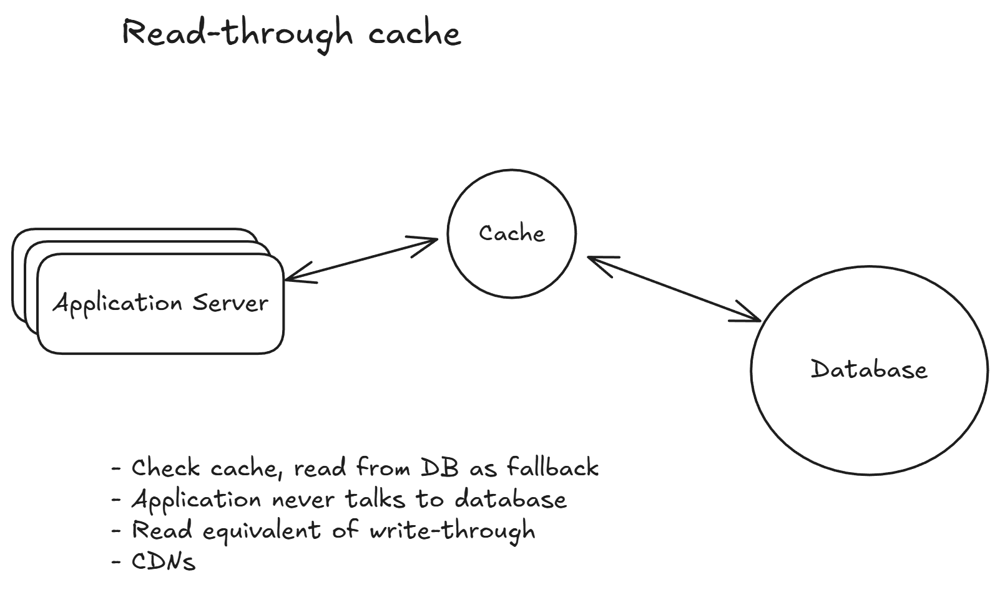

# Caching

Retrieving from a cache takes 100 nanos while an SSD read takes 1ms (10000x)

## Where to cache

## Cache strategies

## Eviction Policies
- Least recently used (LRU)
    - Best when recently used data is likely to be used again
- Least frequently used (LFU)
    - When keys are consistently popular over time
- First in first out (FIFO)
    - Ignores usage patterns, rarely used
- Time to live (TTL)
    - Combined with LRU/LFU to balance freshness
    - When data must eventually refresh

## Problems
### Cache stampede (thundering herd)
When a popular cache entry expires and many requests try to rebuild it at the same time. Then, **thousands** of database queries, which overwhelms the DB.

- Request coalescing: allow only one request to rebuild the cache while others wait for the result
- Cache warming: refresh popular keys proactively. Only helpful when using TTL.

### Cache consistency
Cache and DB in sync?
- Cache invalidation on writes: delete the cache entry after updating DB so it is always populated with fresh data
- Short TTLs for stale tolerance
- Eventually consistency

### Hot keys
One key that receives a huge amount of traffic.
- replicate hot keys: store the same value on multiple cache nodes and load balance
- Local fallback cache: keep extremely hot values in-process
- Rate limiting

## When to cache?
- Read heavy workloads
- Expensive queries
- High database CPU
- Latency requirements